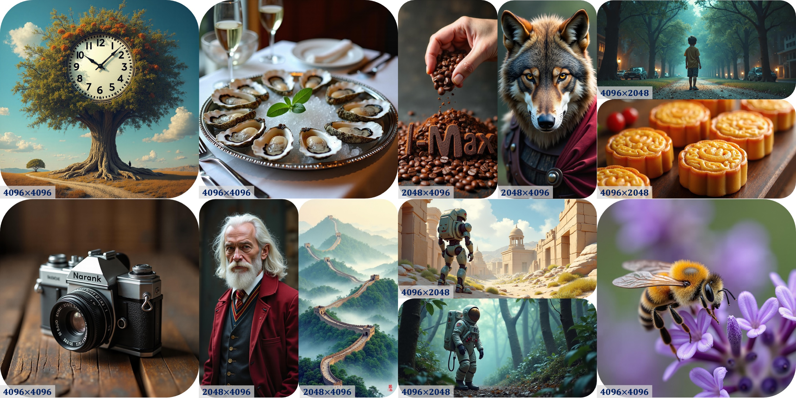
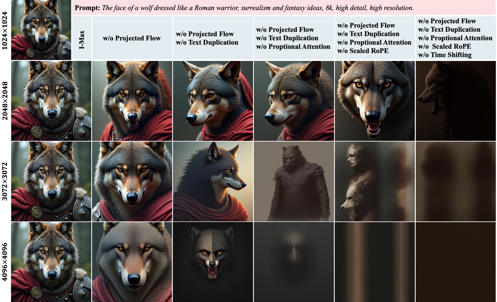
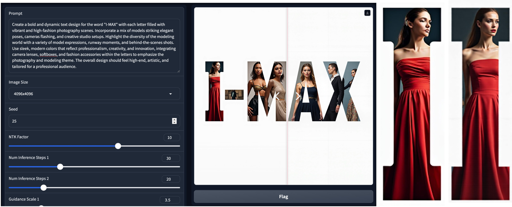

# I-Max: Maximize the Resolution Potential of Pre-trained Rectified Flow Transformers via Projected Flow
[](https://arxiv.org/pdf/2410.07536.pdf)

Official code release for **I-Max + Flux.1-dev** based on diffusers implementation.



**Abstract**: Rectified Flow Transformers (RFTs) offer superior training and inference efficiency, making them likely the most viable direction for scaling up diffusion models. However, progress in generation resolution has been relatively slow due to data quality and training costs. Tuning-free resolution extrapolation presents an alternative, but current methods often reduce generative stability, limiting practical application. In this paper, we review existing resolution extrapolation methods and introduce the I-Max framework to maximize the resolution potential of Text-to-Image RFTs. I-Max features: (i) a novel Projected Flow strategy for stable extrapolation and (ii) an advanced inference toolkit for generalizing model knowledge to higher resolutions. Experiments with Lumina-Next-2K and Flux.1-dev demonstrate I-Max's ability to enhance stability in resolution extrapolation and show that it can bring image detail emergence and artifact correction, confirming the practical value of tuning-free resolution extrapolation.



# QuickStart
Generate 4K high-resolution images and save the generated results along with native-resolution guidance 🤗. The code has just been cleaned, please let us know if there are any issues.
```
import torch
from pipeline_flux_imax import FluxPipeline
from transformer_flux import FluxTransformer2DModel

bfl_repo="black-forest-labs/FLUX.1-dev"
transformer = FluxTransformer2DModel.from_pretrained(bfl_repo, subfolder="transformer", torch_dtype=torch.bfloat16)
pipe = FluxPipeline.from_pretrained(bfl_repo, transformer=None, torch_dtype=torch.bfloat16)
pipe.transformer = transformer
pipe.scheduler.config.use_dynamic_shifting = False
pipe.to("cuda")

prompt = "A bustling open-air café on a Parisian street, with people sitting at small tables sipping coffee and chatting, waiters weaving through the crowd, and artists sketching on the sidewalk as the Eiffel Tower looms in the background." 
save_name = "test.jpeg"
torch.random.manual_seed(int(25))
images = pipe(prompt=prompt,
            num_inference_steps1=30, num_inference_steps2=30, 
            guidance_scale1=3.5, guidance_scale2=7,
            height=4096, width=4096,
            ntk_factor=10,
            return_dict=False,
            time_shift_1=3, time_shift_2=6,
            proportional_attention = True,
            text_duplication = True,
            swin_pachify = True,
            guidance_schedule = "cosine_decay",
            )
images[0].save(save_name)
images[1].save("guidance_" + save_name)
```
Or you can directly launch a local Gradio demo via:
```
python gradio_demo.py
```


